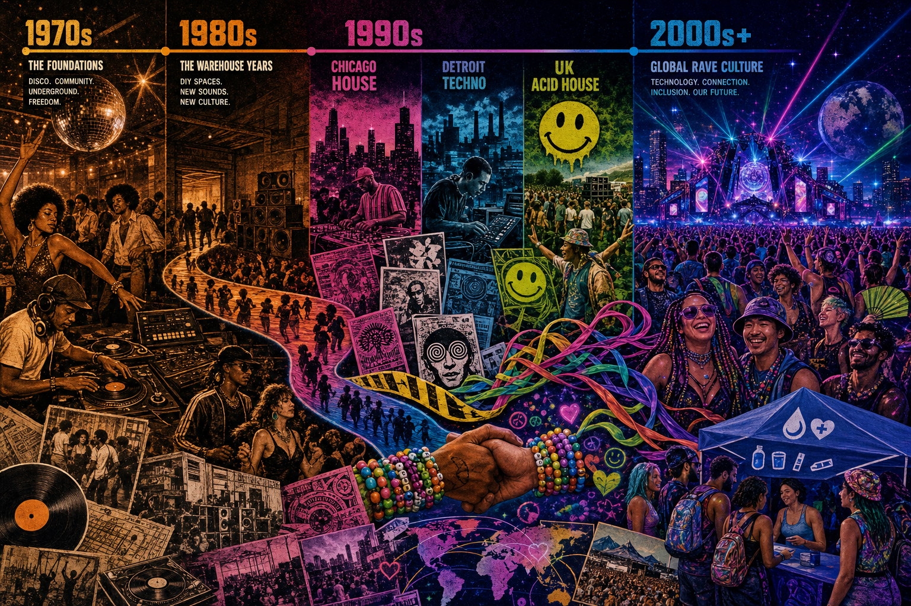

# Rave Culture Field Guide



A living, source-grounded field guide to rave culture: where it came from, what changed it, why it matters, and how to participate with skill, respect, and care.

This repo is built as a fun educational launch artifact: part history zine, part DJ primer, part culture map, part harm-reduction/safety guide.

## What is inside

- `docs/history/ORIGINS_TO_NOW.md` — disco warehouses, Chicago house, Detroit techno, acid house, UK free parties, US rave, PLUR, the RAVE Act, EDM festivals, pandemic livestreams, and current underground revival.
- `docs/history/TIMELINE.md` — key dates from 1960s light-show psychedelia to modern global festival culture.
- `docs/legal-and-safety/RAVE_ACT_AND_POLICY.md` — RAVE Act / Illicit Drug Anti-Proliferation Act context, UK Criminal Justice Act context, and how policy shaped safety decisions.
- `docs/legal-and-safety/HARM_REDUCTION.md` — water, heat, hearing, consent, drug-checking context, naloxone, and fail-closed event care.
- `docs/culture/PLUR_AND_COMMUNITY.md` — PLUR, kandi, etiquette, underground vs mainstream, inclusion, and anti-harassment norms.
- `docs/dj/HOW_TO_DJ.md` — beginner guide to gear, beatmatching, phrasing, EQ, transitions, set-building, and practice drills.
- `docs/dj/DJ_TERMINOLOGY.md` — glossary of DJ/rave/music terms.
- `docs/sources/SOURCES.md` — source list and reading path.
- `CONTRIBUTING.md` — community contribution guide and review standards.
- `.github/ISSUE_TEMPLATE/` — starter issue forms for city chapters, corrections/sources, and DJ guide improvements.
- `docs/community/CITY_CHAPTER_TEMPLATE.md` — reusable city/regional chapter template.
- `data/timeline.json` — machine-readable timeline data.
- `scripts/verify.py` — lightweight repo verifier.

## Quick start reading path

1. Start with `docs/history/ORIGINS_TO_NOW.md`.
2. Skim `docs/history/TIMELINE.md` to anchor the dates.
3. Read `docs/legal-and-safety/RAVE_ACT_AND_POLICY.md` before making claims about the RAVE Act.
4. Read `docs/dj/HOW_TO_DJ.md` and practice the drills.
5. Use `docs/dj/DJ_TERMINOLOGY.md` as a decoder ring.
6. Want to help? Read `CONTRIBUTING.md`, then use an issue template or the city chapter template.

## Community starter kit

This project is set up for public-safe community growth under the **Sonic-Forage** organization:

- Canonical repo: https://github.com/Sonic-Forage/rave-culture-field-guide
- Contribution guide: `CONTRIBUTING.md`
- Issue templates: `.github/ISSUE_TEMPLATE/`
- City chapter template: `docs/community/CITY_CHAPTER_TEMPLATE.md`

Use the templates to propose source-backed corrections, city chapters, DJ terminology improvements, or safer-event notes without exposing private scene details.

## Core idea

Rave culture is not just “loud music and lasers.” It is a lineage of:

- Black, Latino, queer, working-class, immigrant, and DIY dance spaces.
- DJs turning records and machines into long-form social ritual.
- Warehouse parties, free parties, clubs, festivals, pirate radio, zines, flyers, and now streams/social/video.
- A constant push-pull between underground autonomy, commercial spectacle, criminalization, safety, and community care.

## Safety and legality note

This repo is educational. It does not encourage illegal activity or drug use. It does encourage safer event design, consent culture, hydration, hearing protection, medical readiness, accurate information, and respect for local law.

## Local verification

```bash
python3 scripts/verify.py
```

## License

- Text/docs/code: MIT (`LICENSE`).
- Generated image: AI-generated educational repo asset; treat as project artwork, not historical evidence.
